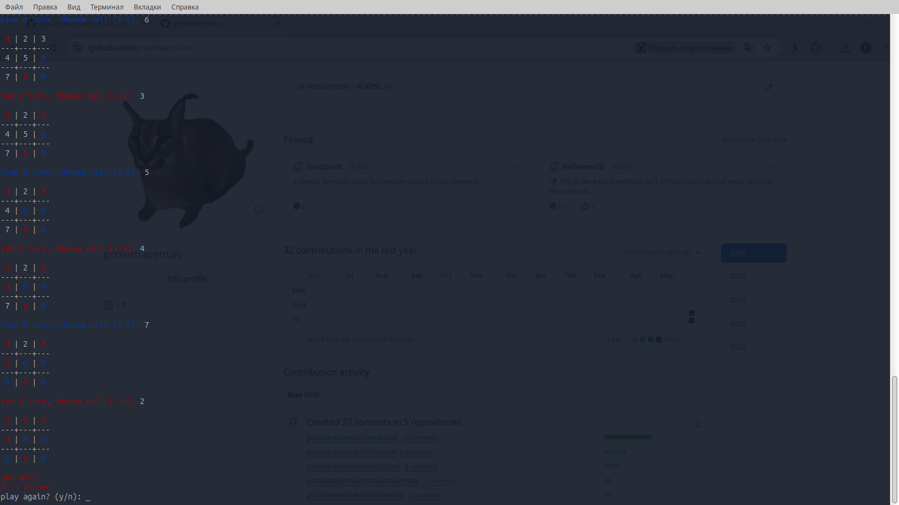

# tictactoe
A Linux terminal Tic-Tac-Toe game licensed under GPLv3.
very simple game on C++
# install compile:
1. download tictactoe.cpp
2. run "g++ tictactoe.cpp -o tictactoe"
3. play ./tictactoe
# install:
1.go to the releases page

2.download versoin for your distro

3.on debian/ubuntu sudo dpkg -i tictactoe_(version).deb
# use:
1.run 'tictactoe'

2. play

# report bugs to issues page on github
